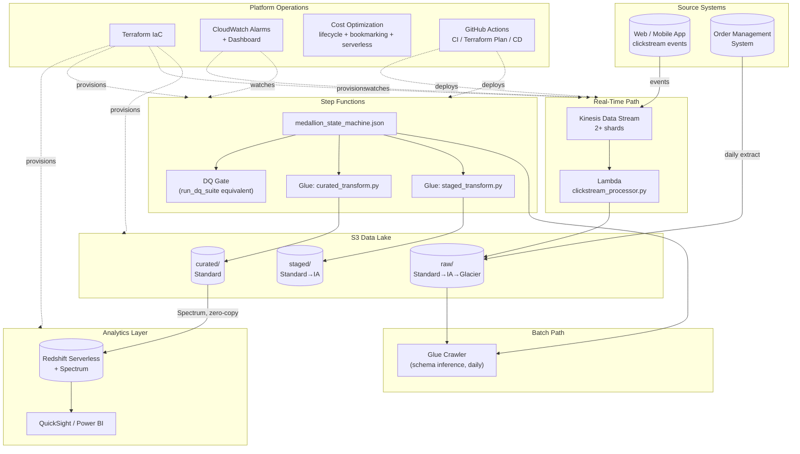

# AWS Customer 360 Platform


**[← Back to live portfolio](https://andiswamatai.github.io)**

A signature, end-to-end AWS data platform: real-time clickstream via Kinesis + Lambda, batch ETL via Glue, orchestration via Step Functions, and a Customer 360 analytics layer in Redshift Serverless — with the infrastructure, data quality, monitoring, cost optimization, and CI/CD that turn a pipeline into a production platform.

This is the AWS counterpart to my Azure/Fabric flagship platform, built to demonstrate the same production-architecture thinking on the other major cloud — directly relevant to the AWS work in my background at Experian (Glue, Lambda, Redshift) and Arena Holdings.

## Why this exists

A Customer 360 view is one of the hardest data engineering problems in e-commerce/retail: it requires joining a high-volume, mostly-anonymous real-time clickstream against a much smaller, fully-identified transaction table, at a customer grain, fast enough that marketing and CRM teams can act on it. This repository builds that, with both ingestion paths (batch + streaming) converging into one governed Customer 360 table, and every production concern — cost, monitoring, IaC, CI/CD — built out alongside it, not bolted on afterward.

## Architecture



## What's actually runnable vs. what's reference architecture

| Component | Status |
|---|---|
| `engine/` — full raw→staged→curated pipeline | **Runs locally**, pandas, no AWS account needed |
| `data_quality/` — completeness, uniqueness, referential integrity, freshness | **Runs locally**, tested |
| `cost_optimization/cost_calculator.py` | **Runs locally**, models real savings from the Terraform config |
| `tests/` | **Runs locally**, 7 passing unit tests |
| `terraform/*.tf` | **Valid HCL**, `terraform validate`-able, not applied (no AWS account) |
| `glue_jobs/*.py` | **Valid PySpark**, written exactly as it would run as a Glue job, mirrors `engine/` 1:1 |
| `lambda/clickstream_processor.py` | **Valid, deployable Lambda handler**, no AWS-specific mocking needed beyond `boto3` |
| `step_functions/*.json` | **Valid Amazon States Language**, matches the real Step Functions schema |
| `monitoring/*.json` | **Valid CloudWatch dashboard schema** |
| `.github/workflows/cd.yml` | **Documents the real deployment commands**, doesn't execute against live infra |

## Repository Structure

```
engine/                  Local-runnable pipeline (raw → staged → curated)
glue_jobs/                Production PySpark ETL scripts (1:1 mirror of engine/)
lambda/                   Kinesis clickstream consumer
step_functions/           State machine orchestrating Glue jobs + DQ gate
terraform/                Full IaC: S3, Glue, Kinesis, Lambda, Step Functions, Redshift
monitoring/                CloudWatch alarms (Terraform) + dashboard JSON
cost_optimization/        Working cost model + the controls it measures
data_quality/             Standalone DQ framework (completeness/unique/RI/freshness)
tests/                    Unit tests for engine + DQ framework
.github/workflows/        CI, Terraform Plan, CD
```

## Running the local pipeline

```bash
pip install -r requirements.txt
python engine/generate_sample_data.py     # ~10s, ~933K rows
python engine/medallion_pipeline.py       # ~10s, full raw→staged→curated
python data_quality/run_dq_suite.py       # DQ gate — same checks as production
python cost_optimization/cost_calculator.py
```

Run the tests:

```bash
python -m unittest discover -s tests -v
```

## Sample Output

```
CONVERSION FUNNEL (all customers)
         stage  event_count
     page_view       173176
  product_view        96296
   add_to_cart        49998
checkout_start        27110
      purchase        19142

Average customer conversion rate: 22.65%

DATA QUALITY: 0 of 7 checks failed. Curated layer is safe to load into Redshift.

COST OPTIMIZATION:
  S3 lifecycle tiering savings:    $21.82/month  (48.5%)
  Glue job bookmarking savings:    $133.98/month (84.6%)
  Redshift Serverless savings:     $660.00/month (55.0%) vs always-on equivalent
  Lambda batching savings:         $5.47/month   (99.3%)
  TOTAL ESTIMATED ANNUAL SAVINGS:  $9,855.22
```

## Why both a batch and streaming path

Order/transaction data updates at business pace — a daily Glue Crawler scan plus scheduled ETL is the right cost/complexity tradeoff. Clickstream is different: 700K+ events covering page views, cart adds, and checkout starts, the majority from anonymous (not-yet-identified) visitors. That volume and arrival pattern is what Kinesis + Lambda is built for — batching up to 500 records or 30 seconds (whichever comes first) before a single S3 write, instead of either a 700K-row daily batch job or 700K individual Lambda invocations.

## Production readiness checklist

- [x] Infrastructure as Code (Terraform, environment-separated via `.tfvars`)
- [x] CI/CD (GitHub Actions: test → plan → deploy, with a DQ smoke test gate)
- [x] Data quality enforced as a Step Functions gate, not an afterthought
- [x] Monitoring & alerting (4 distinct CloudWatch alarms, tiered by what they signal)
- [x] Cost optimization (S3 tiering, Glue bookmarking, Redshift Serverless, Lambda batching — all measured)
- [x] IAM least-privilege roles per service (Glue, Lambda, Step Functions, EventBridge)
- [x] S3 public access blocked + SSE encryption by default on every bucket
- [x] Real-time + batch ingestion paths, converging into one staged/curated layer
- [x] Job bookmarking for idempotent, incremental ETL — never reprocesses unchanged data
- [x] Redshift Spectrum for zero-copy analytics querying directly off curated Parquet

## License

MIT — all data is synthetic.
